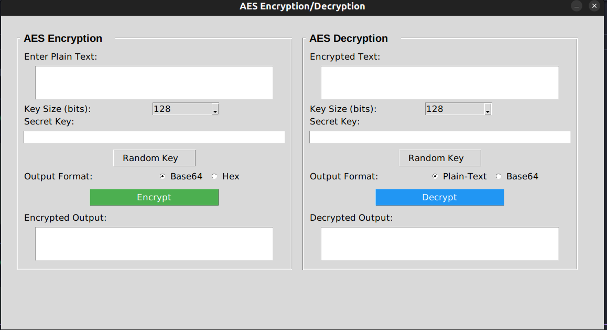

# Công cụ mã hóa AES  
*Dự án môn Bảo mật máy tính*

## Giới thiệu  
**Công cụ mã hóa AES** là ứng dụng phát triển cho môn **Bảo mật máy tính**, sử dụng thuật toán mã hóa đối xứng **AES (Advanced Encryption Standard)** để bảo vệ tệp tin khỏi truy cập trái phép. Giao diện đồ họa được xây dựng bằng `tkinter` trên Python, mang đến trải nghiệm thân thiện và minh họa thực tế về bảo mật dữ liệu.

## Ảnh minh họa  


## Mục tiêu  
- Triển khai AES với khóa 128/192/256 bit.  
- Xây dựng công cụ mã hóa/giải mã tệp tin.  
- Kiểm tra tính hợp lệ của khóa và tạo giao diện dễ sử dụng.

## Tính năng  
- **Tìm kiếm tệp**: Tìm tệp theo từ khóa trong thư mục.  
- **Chọn tệp**: Qua hộp thoại hoặc danh sách kết quả.  
- **Tạo khóa**: Khóa ngẫu nhiên 128/192/256 bit.  
- **Mã hóa/Giải mã**: Xử lý tệp với khóa tùy chọn.  
- **Quản lý khóa**: Hiện/ẩn và sao chép khóa vào clipboard.  
- **Giao diện**: Căn giữa màn hình, nút lớn, trạng thái rõ ràng.

## Công nghệ  
- **Ngôn ngữ**: Python 3.x  
- **Thư viện**:  
  - `tkinter`: Giao diện đồ họa  
  - `pyperclip`: Sao chép clipboard  
  - `os`: Quản lý tệp  
  - `pycryptodome`: Thư viện mã hóa AES (hỗ trợ các chế độ như CBC, ECB)  
- **Thuật toán**: AES

## Cài đặt  
1. Cài Python 3.x (khuyến nghị phiên bản mới nhất).  
2. Cài các thư viện:  
   ```bash  
   pip install pyperclip pycryptodome  